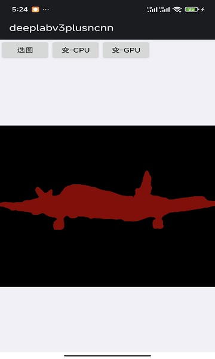

# ncnn-android-deeplabv3plusncnn

​	This is an ncnn Android project for DeepLabV3Plus, currently performing inference on a single image. The ncnn code comes from my own repository:[DeepLabV3Plus-Pytorch-Model-deployment](https://github.com/gaoxumustwin/DeepLabV3Plus-Pytorch-Model-deployment)

## how to build and run
### step1

https://github.com/Tencent/ncnn/releases

* Download ncnn-YYYYMMDD-android-vulkan.zip or build ncnn for android yourself
* Extract ncnn-YYYYMMDD-android-vulkan.zip into **app/src/main/jni** and change the **ncnn_DIR** path to yours in **app/src/main/jni/CMakeLists.txt**

### step2

https://github.com/nihui/opencv-mobile

* Download opencv-mobile-XYZ-android.zip
* Extract opencv-mobile-XYZ-android.zip into **app/src/main/jni** and change the **OpenCV_DIR** path to yours in **app/src/main/jni/CMakeLists.txt**

### step3
open this project with Android Studio, build it and enjoy!

## screenshot

